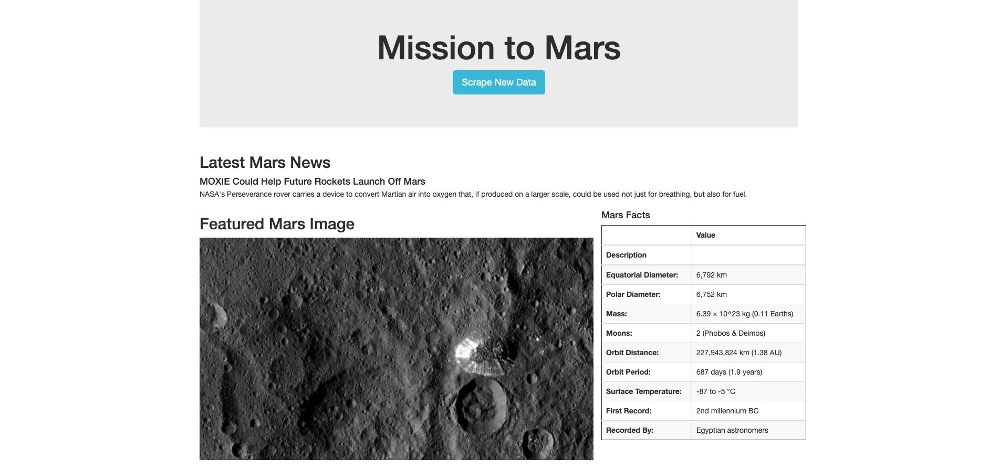
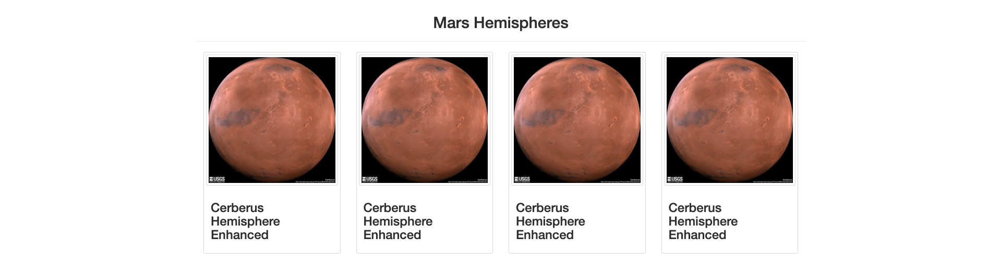

# Mission-to-Mars
In this project I am web scarping from Nasa's website using Splinter, Web-Driver Manager and Beautiful Soup. Through web scraping, I am storing data from Nasa's website in a MongoDB. Lastly, I created a webpage from the data and inforamtion I gathered from Nasa's website, using Flask & HTMl. 

## Purpose
To scrape Nasa's website, to create a webpage with concise information around Mars. This webpage includes the latest news article on Mars, a corresponding image, a table of Mars facts and Mars hemispheres. 

## Overview 
* Search through Nasa's website to select the best information we want to gather for our webpage
* Inspect each site, to understand the HTML code present, and how we can call the information we are looking for 
* Creating a scraping.py file to gather the news title, news paragraph, Mars facts and Mars hemisphere from the Nasa website
* Creating a flask to pull the information we have scraped into a webpage
* Creating an index.HTML file to structure how we want our webpage to look 

## Results
A webpage that you can scrape for the most updated information on Mars from Nasa's website

